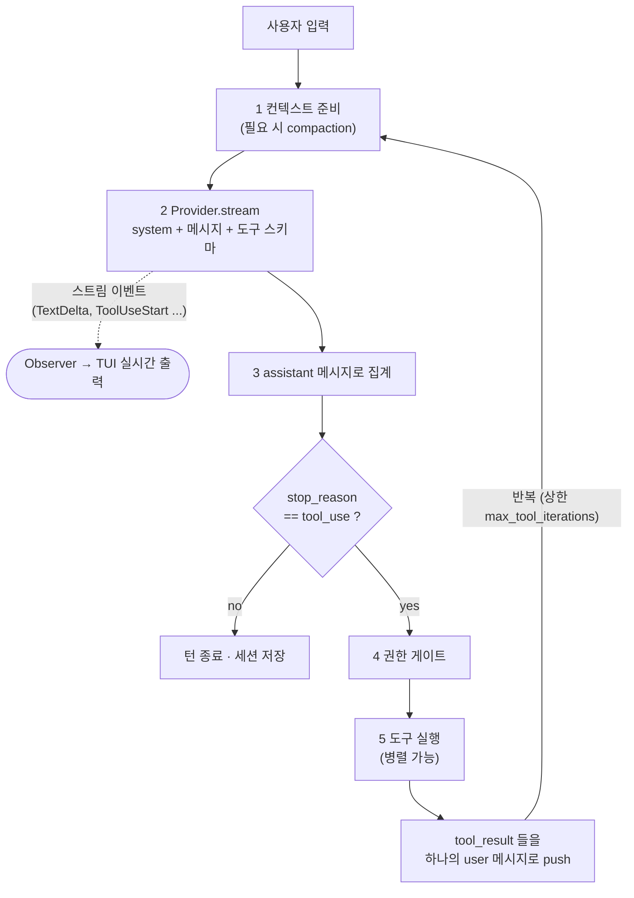
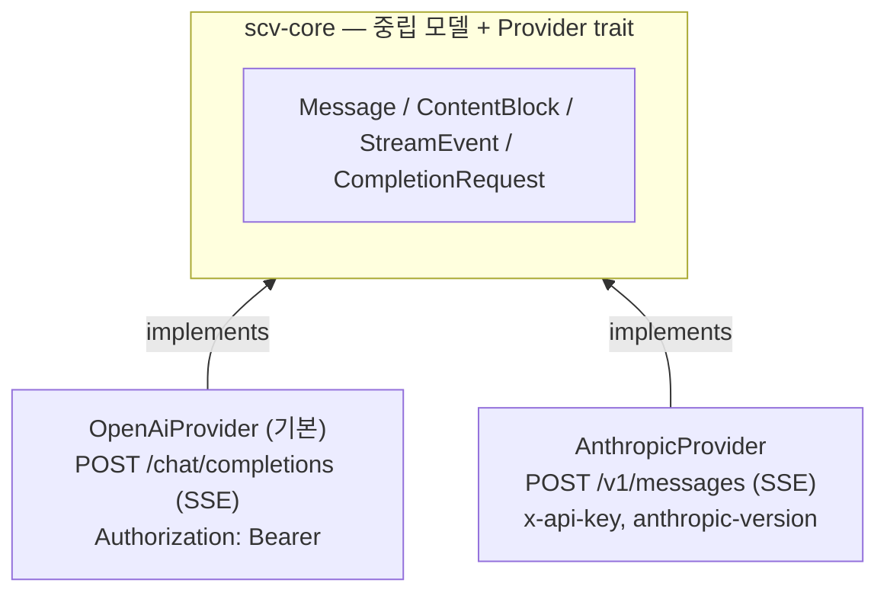
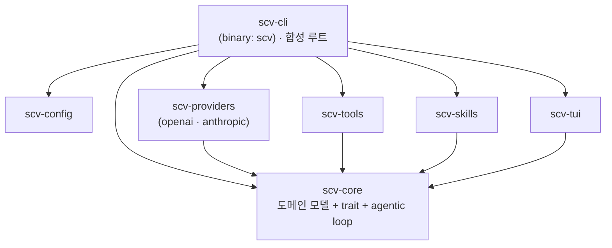

# scv 아키텍처 개요

> 자체 코딩 에이전트(Claude Code / Codex 류)를 Rust 로 구축하기 위한 설계 문서.
> 대상 독자: 이 저장소에 처음 합류한 개발자(온보딩).

## 1. 무엇을 만드는가

`scv` 는 **터미널에서 동작하는 인터랙티브 코딩 에이전트**다. 사용자의 자연어 요청을
받아, LLM 이 판단하고, 도구(파일 읽기/쓰기/bash/검색 등)를 호출해 실제 작업을
수행하고, 그 결과를 다시 LLM 에게 돌려주는 루프를 반복해 과제를 끝까지 처리한다.

요구되는 4대 기능:

| 기능 | 한 줄 정의 | 담당 |
|------|-----------|------|
| **시스템 프롬프트** | 에이전트의 정체성·환경·프로젝트 맥락을 계층적으로 합성 | `scv-core::system_prompt` |
| **세션** | 대화 트랜스크립트의 보관·재개·컨텍스트 관리 | `scv-core::session`, `scv-core::context` |
| **툴(도구)** | 모델이 호출하는 "행동"과 그 권한 게이팅 | `scv-core::tool` + `scv-tools` |
| **스킬** | 작업별 절차/지식을 필요할 때만 로드(progressive disclosure) | `scv-core::skill` + `scv-skills` |

추가 설계 결정:
- **언어/런타임**: Rust + Tokio(async)
- **LLM 연동**: 멀티 프로바이더 추상. **기본은 OpenAI(ChatGPT 5.5, `gpt-5.5`)**,
  Anthropic 은 `--provider anthropic` 으로 전환 가능
- **인터페이스**: 인터랙티브 CLI/TUI(원샷 모드도 지원)

## 2. 핵심 개념 — Agentic Loop

에이전트의 심장은 "한 사용자 턴을 끝까지 구동하는 루프"다.



구현: `scv-core::agent::Agent::run_turn`.

이 루프의 핵심 설계 원칙은 **"엔진은 구체 타입을 모른다"** 이다. `Agent` 는
`dyn Provider`, `dyn Tool`, `dyn PermissionGate`, `dyn ContextManager` 같은 trait
object 만 들고 있다. 따라서 어떤 프로바이더/도구 조합과도 같은 루프가 동작한다.

## 3. 멀티 프로바이더 추상

프로바이더마다 와이어 포맷이 다르다(Anthropic Messages API vs OpenAI Chat
Completions). 핵심 전략:

1. **프로바이더 중립 도메인 모델**을 코어에 둔다 — `Message`, `ContentBlock`,
   `StreamEvent`, `StopReason`, `Usage` (`scv-core::message`).
2. 각 어댑터(`scv-providers::anthropic`, `::openai`)가 이 중립 모델 ↔ 자기 와이어
   포맷을 **양방향 변환**한다.
3. 코어/루프/세션/TUI 는 오직 중립 모델만 본다.



> **기본 프로바이더는 OpenAI(ChatGPT 5.5, 모델 id `gpt-5.5`)** 다. Anthropic 은
> `--provider anthropic` 으로 전환해 쓰는 대체 프로바이더다.
>
> 두 프로바이더 모두 공식 Rust SDK 가 없어 `reqwest` + `eventsource-stream` 으로
> 직접 호출한다. 사고/효과·인증 헤더 등 프로바이더별 차이는 각 어댑터가 흡수한다
> (예: Anthropic 은 `thinking: {type:"adaptive"}` + `output_config.effort`,
> `x-api-key` 헤더 / OpenAI 는 `Authorization: Bearer` + 자체 reasoning 파라미터).
>
> **토큰 카운트도 어댑터 책임이다** — `Provider::count_tokens` 를 어댑터별로 구현한다
> (Anthropic: `/v1/messages/count_tokens`, OpenAI: 로컬 토크나이저 tiktoken). 단
> compaction 트리거의 **주 신호는 응답에 실려 오는 usage(`input_tokens`)** 이고,
> `count_tokens` 는 사전 점검 보조용이다(§4.2).

새 프로바이더 추가 = `Provider` 한 개 구현 + `scv_providers::build` 에 `kind` 분기
한 줄. 코어·도구·TUI 는 손대지 않는다.

## 4. 4대 기능 상세

### 4.1 시스템 프롬프트 — 계층형 합성

`SystemPromptBuilder` 가 여러 출처를 **안정적인 것 → 휘발성 높은 것** 순서로 합친다:

```
1. base identity     (정적)     에이전트 정체성/행동 규칙
2. environment       (세션)     OS, cwd, 날짜
3. project context   (세션)     AGENTS.md 탐색 체인 (ProjectContextLoader)
4. available skills  (세션)     스킬 name+description 목록 ← 스킬 기능과 연결
5. dynamic reminders (턴)       런타임 주입 메모(가장 뒤)
```

이 순서는 **프롬프트 캐시(prefix-match)** 를 위한 것이다. 앞부분이 고정돼야 캐시가
히트한다. `cwd`/날짜 같은 가변값을 맨 앞에 끼우면 캐시가 매번 깨진다.

**프로젝트 컨텍스트(3) 로딩 — AGENTS.md 탐색 체인.** scv 가 대상 프로젝트에서 시동할 때
`ProjectContextLoader` 가 진입 컨텍스트 문서를 찾아 합성한다. **새 파일 포맷을 만들지
않고 다른 에이전트 도구와 같은 파일(`AGENTS.md`)을 그대로 읽어** 호환된다 — 이미 다른
도구용으로 세팅된 repo 가 scv 에서도 그냥 동작한다.

- **탐색 체인**: repo 루트 `AGENTS.md` → 하위 디렉터리 `AGENTS.md`(디렉터리 스코프)
  → 사용자 전역 `~/.config/scv/AGENTS.md` → 폴백 `CLAUDE.md`.
- **병합**: 더 구체적인(하위/프로젝트) 것이 상위에 덧붙거나 덮는다. 충돌 시 더 가까운
  것 우선.
- **신규 이름 도입 안 함**(WORKER.md 등). 굳이 scv 고유 별칭이 필요하면 오버라이드로만
  인식하고 캐노니컬 출처는 `AGENTS.md` 로 둔다(생태계 파편화 방지).

### 4.2 세션 — 트랜스크립트 + 영속화 + 컨텍스트 관리

- `Session` = `{id, created_at, messages}`. 메시지 히스토리를 들고 있다.
- 영속화는 `SessionStore` trait 으로 추상화. 기본 구현 `FileSessionStore` 는
  `<dir>/<id>.jsonl` 에 메시지를 한 줄당 하나씩 저장 → `scv --resume <id>` 로 재개,
  사후 감사 가능. (구현이 `scv-cli` 에 있는 이유: 코어는 "어디에 저장할지"를 몰라야 함.)
- 컨텍스트가 모델 윈도에 근접하면 `ContextManager` 가 히스토리를 줄인다(compaction).
  전략은 trait 으로 교체 가능(`NoopContextManager` → 향후 두 가지):
  - **트리거 신호**: 직전 응답의 `Usage.input_tokens` 를 **우선** 본다(추가 호출 0).
    임계치는 `[session].compact_threshold_tokens`(기본 150K). 첫 전송 전 거대 입력 등
    사전 점검이 필요할 때만 `Provider::count_tokens`(어댑터별)를 보조로 쓴다.
  - `SummarizingContextManager` — 오래된 앞부분을 LLM 으로 요약(최근 턴은 verbatim
    유지해 정밀도 보존). 요약 호출도 `Provider` 를 통해 한다.
  - `ClearToolResultsManager` — 오래된 tool_result 를 *요약 말고 비운다*(context
    editing). 원본은 디스크(세션 JSONL/파일)에서 도구로 정밀 재조회.

#### 세션 격리 (여러 세션 동시 실행)

여러 세션(여러 `scv` 프로세스)이 동시에 돌 때의 격리 보장 범위:

| 레이어 | 격리 | 근거 / 한계 |
|--------|------|------------|
| 대화 상태(메모리) | ✅ 자동 | 세션마다 고유 UUID + 자기 `messages`. 프로세스 간 메모리 공유 없음 |
| 영속화(디스크) | ✅ id 기준 | `<dir>/<id>.jsonl` — 세션당 파일 1개. 다른 id → 다른 파일 |
| LLM 프로바이더 | ✅ 논리적 | API 가 stateless(매 요청 전체 컨텍스트 전송). 단 계정 rate limit 은 공유 |
| **파일시스템(도구 부작용)** | ⚠️ **자동 격리 안 됨** | 도구는 `ToolContext.workdir` 의 **실제 파일**을 직접 건드린다. 유일한 경계는 "workdir 밖 금지"뿐 — **workdir 이 다를 때만 분리**되고, 같은 workdir 의 두 세션은 같은 파일/`git` 상태를 공유해 충돌할 수 있다 |
| 설정/스킬 | ✅ | 읽기 전용 로드라 공유 안전 |

핵심: **scv 는 세션별 파일 샌드박스를 만들지 않는다.** 따라서 "같은 repo 에서 여러
세션을 돌려도 안 부딪치게" 하려면 격리를 명시적으로 제공해야 한다.

알려진 한계(현 구현):
- `FileSessionStore::save` 가 파일을 통째로 다시 쓴다(락 없음) → **같은 세션 id 를 두
  프로세스에서 `--resume`** 하면 나중에 저장한 쪽이 덮어쓴다(데이터 손실). 다른 id 는 안전.

계획(완전 격리):
- **per-session git worktree**(또는 임시 workdir) — 세션마다 repo 를 별도 폴더로 체크아웃해
  같은 repo 라도 물리적으로 분리. `ToolContext` 에 세션별 workdir 주입 / `SessionWorkspace`
  추상 도입.
- 세션 파일 **append-only 쓰기 또는 락** — 같은-세션 동시 접근 안전화.
- 한 프로세스에서 다중 세션(서브에이전트)을 돌릴 경우 `SessionManager` + 세션별
  workdir/권한 스코프(현재는 한 프로세스 = 한 대화).

### 4.3 툴 — 행동 + 권한

- `Tool` trait: `name / description / input_schema / permission / parallel_safe / invoke`.
- `ToolRegistry` 가 이름→도구를 관리하고, 프로바이더에 보낼 스키마 목록을 모은다
  (정렬된 `BTreeMap` → 순서 결정적 → 캐시 친화적).
- **도구 로스터**:
  - 내장(client-side 실행): `read` · `write` · `edit` · `bash` · `glob` · `grep`.
  - 계획: `web_fetch`(HTTP GET — 네트워크 egress 라 권한 `Ask` 또는 도메인 allowlist,
    `parallel_safe`), `transcript-search`(세션 JSONL·파일에서 정확 일치 검색 → 손실적
    요약에 의존하지 않는 **정밀 추출** 경로). 둘 다 `Tool` 구현 + 레지스트리 등록만으로
    추가되며 core/루프 변경이 없다.
- **권한 모델**(되돌리기 어려움 기준으로 게이팅):
  - 읽기 전용·부작용 없음(`read`/`glob`/`grep`) → `Allow` + `parallel_safe=true`
  - 파일 수정·`bash` 등 비가역 → `Ask`(매번 사용자 확인)
  - 위험 입력(workdir 밖 경로 등) → `Deny`
- 게이팅은 `PermissionGate` trait 으로 분리: 정적 정책(`StaticPermissionGate`,
  설정 기반) + 대화형 프롬프트(TUI)를 합성한다.
- **보안**: 모든 경로 입력은 `ToolContext.workdir` 안으로 제한(경로 탈출/심볼릭
  링크 방지). bash 명령은 모델이 만든 신뢰 불가 출력으로 취급한다.

왜 bash 하나로 다 하지 않고 도구를 나누나? 전용 도구라야 하네스가 그 행동을
**게이팅/렌더링/감사/병렬화**할 수 있다. bash 명령 문자열은 하네스 입장에서 불투명해
이런 처리가 불가능하다. (원칙: 넓게는 bash 로 시작, 게이팅·렌더링이 필요해지면 전용
도구로 승격.)

### 4.4 스킬 — progressive disclosure

스킬 = 디렉터리 하나(`SKILL.md` + 보조 리소스). `SKILL.md` 는 YAML frontmatter
(`name`, `description`, `when_to_use`) + Markdown 본문(절차)으로 구성된다.

핵심은 **점진적 공개**:
- 평소 컨텍스트에는 스킬의 `name`+`description` 만 올린다(시스템 프롬프트 §4 목록).
- 모델이 특정 스킬을 쓰기로 하면 그때 본문을 로드해 주입한다.
- → 토큰을 아끼면서 필요한 순간에만 상세 지침을 제공.

`scv-skills::load_dirs` 가 디렉터리들을 훑어 `SkillRegistry` 를 채운다.

## 5. 크레이트 구조

Cargo 워크스페이스. 의존성은 항상 `scv-core` 를 향한다(순환 없음).



| 크레이트 | 책임 | 의존 |
|---------|------|------|
| `scv-core` | 도메인 타입, 4대 기능의 trait, agentic loop | (내부 의존 없음) |
| `scv-config` | TOML/환경변수 설정 로드·병합 | — |
| `scv-providers` | `Provider` 구현 + 와이어 변환 | core |
| `scv-tools` | 내장 도구 + 정적 권한 정책 | core |
| `scv-skills` | `SKILL.md` 파싱 → `SkillRegistry` | core |
| `scv-tui` | 대화 UI, 스트림 렌더, 권한 모달 | core |
| `scv-cli` | 부트스트랩/조립, 세션 파일 저장, CLI 파싱 | 전부 |

이 배치의 이점: 새 프로바이더/도구/스킬을 추가할 때 **core 와 다른 크레이트를 건드릴
필요가 없다**. 의존성 역전(core 가 trait 을 정의, 바깥이 구현)이 핵심이다.

## 6. 데이터 모델 (요약)

```rust
enum Role { User, Assistant, System }

enum ContentBlock {
    Text { text },
    Thinking { text, signature },
    ToolUse { id, name, input: Value },     // 모델 → 도구 호출 요청
    ToolResult { tool_use_id, content, is_error },  // 도구 → 결과
}

struct Message { role: Role, content: Vec<ContentBlock> }

enum StreamEvent {                          // 프로바이더 공통 정규화 이벤트
    MessageStart { model }, TextDelta(String), ThinkingDelta(String),
    ToolUseStart { id, name }, ToolUseInputDelta { id, partial_json },
    ContentBlockStop, MessageStop { stop_reason, usage },
}
```

규칙(중요):
- 한 assistant 메시지는 text + 여러 tool_use 블록을 동시에 가질 수 있다.
- **병렬 도구 결과는 반드시 하나의 user 메시지**에 담아 보낸다(분산 금지 — 모델이
  병렬 호출을 멈추도록 잘못 학습됨).
- tool_use 의 `input` 은 항상 JSON 파싱으로 다룬다(직렬화 문자열 매칭 금지).

## 7. 확장 포인트

| 추가하고 싶은 것 | 해야 할 일 |
|----------------|-----------|
| 새 LLM 프로바이더 | `Provider` 구현 + `scv_providers::build` 분기 추가 |
| 새 도구 | `Tool` 구현 + `default_registry` 에 등록 |
| 새 스킬 | `SKILL.md` 디렉터리만 추가(코드 변경 없음) |
| compaction 전략 | `ContextManager` 구현 후 주입 |
| 세션 저장 백엔드 | `SessionStore` 구현(파일 → DB/원격) |
| 권한 UX | `PermissionGate` 구현(정적 + 대화형 합성) |

## 8. 다음 단계(스캐폴드 → 동작)

현재 저장소는 **타입·trait·조립 골격**까지 완성된 스캐폴드다. 동작하는 MVP 까지의
순서:

1. `AnthropicProvider::stream` — 실제 SSE 파싱과 와이어 변환 채우기(가장 먼저).
2. `MessageAssembler` — tool_use 집계 완성.
3. `read` 외 내장 도구(`write`/`edit`/`bash`/`glob`/`grep`) 구현.
4. `scv-tui::App` — ratatui 대화 루프 + 권한 모달.
5. `FileSessionStore` 를 루프에 연결(`--resume`).
6. `Provider::count_tokens` 어댑터 구현(Anthropic count 엔드포인트 / OpenAI tiktoken).
   단, 루프의 compaction 신호는 returned usage(`MessageStop`)를 우선 사용.
7. `ContextManager` 두 전략 — `SummarizingContextManager`(요약) /
   `ClearToolResultsManager`(tool_result 비우기). 루프에 주입.
8. 계획 도구 — `web_fetch`, `transcript-search`(정밀 추출). `Tool` 구현 + 레지스트리 등록.
9. 세션 격리 — per-session git worktree(또는 임시 workdir) + 세션 파일 append-only/락
   (§4.2 세션 격리 참고). 다중 세션을 한 프로세스서 돌릴 경우 `SessionManager`.
10. `ProjectContextLoader` — AGENTS.md 탐색 체인(루트→하위→전역, CLAUDE.md 폴백) + 병합
    (§4.1 참고). 결과를 `SystemPromptBuilder.project_context` 로 주입.

각 단계는 독립 테스트 가능하도록 trait 경계에서 끊어 둔다.
