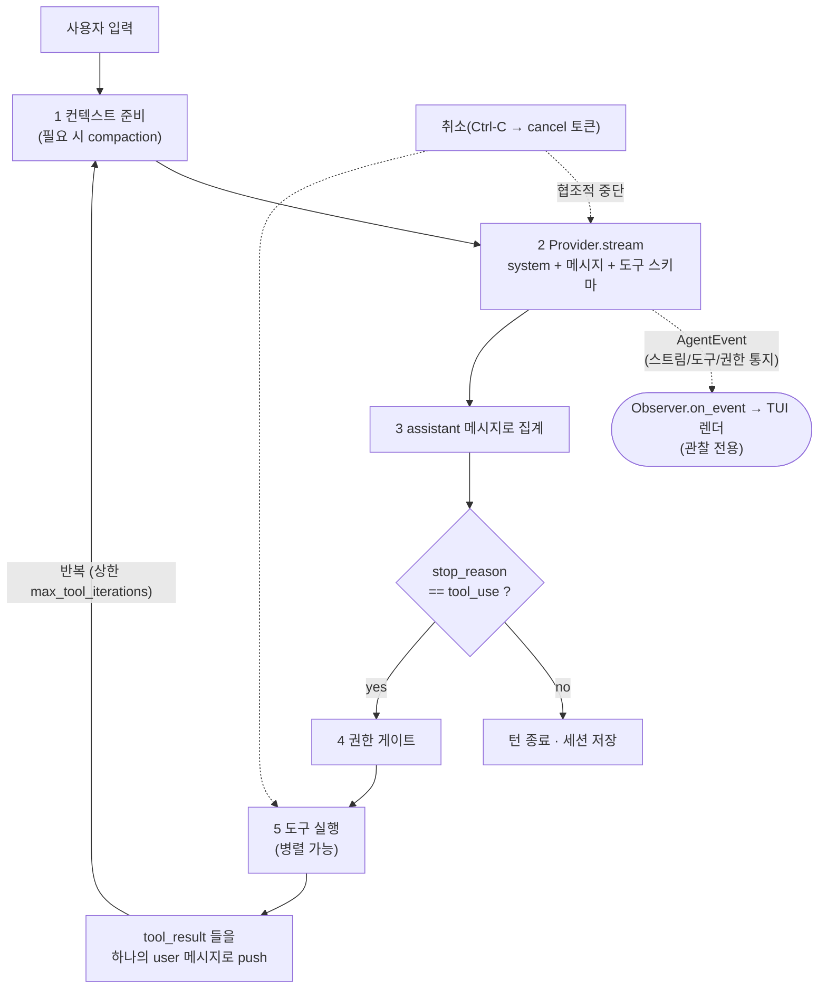
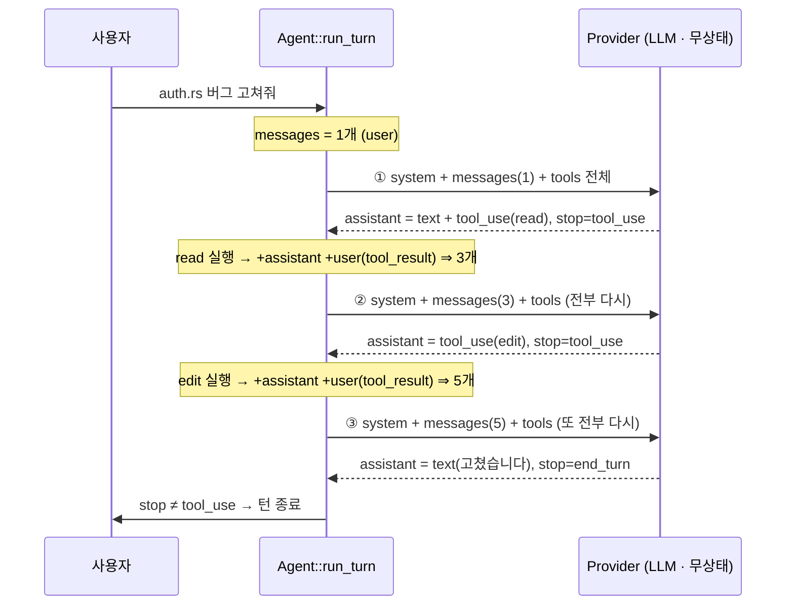
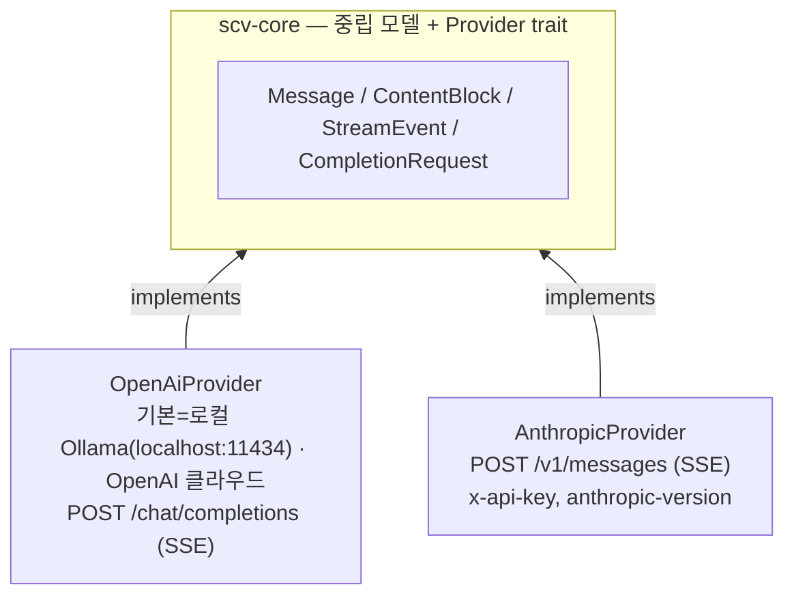
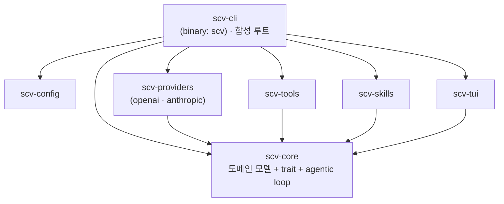

# scv 아키텍처 개요

> 자체 코딩 에이전트(Claude Code / Codex 류)를 Rust 로 구축하기 위한 설계 문서.
> 대상 독자: 이 저장소에 처음 합류한 개발자(온보딩).

## 1. 무엇을 만드는가

`scv` 는 **터미널에서 동작하는 인터랙티브 코딩 에이전트**다. 사용자의 자연어 요청을
받아, LLM 이 판단하고, 도구(파일 읽기/쓰기/bash/검색 등)를 호출해 실제 작업을
수행하고, 그 결과를 다시 LLM 에게 돌려주는 루프를 반복해 과제를 끝까지 처리한다.

요구되는 4대 기능:

| 기능 | 한 줄 정의 | 담당 |
|------|-----------|------|
| **시스템 프롬프트** | 에이전트의 정체성·환경·프로젝트 맥락을 계층적으로 합성 | `scv-core::system_prompt` |
| **세션** | 대화 트랜스크립트의 보관·재개·컨텍스트 관리 | `scv-core::session`, `scv-core::context` |
| **툴(도구)** | 모델이 호출하는 "행동"과 그 권한 게이팅 | `scv-core::tool` + `scv-tools` |
| **스킬** | 작업별 절차/지식을 필요할 때만 로드(progressive disclosure) | `scv-core::skill` + `scv-skills` |

추가 설계 결정:
- **언어/런타임**: Rust + Tokio(async)
- **LLM 연동**: 멀티 프로바이더 추상. **기본은 로컬(Ollama, `qwen3.5:9b`)** — 무료·오프라인,
  OpenAI(`gpt-5.5`)·Anthropic 은 `--provider openai|anthropic` 으로 전환 가능
- **인터페이스**: 인터랙티브 CLI/TUI(원샷 모드도 지원)

## 2. 핵심 개념 — Agentic Loop

에이전트의 심장은 "한 사용자 턴을 끝까지 구동하는 루프"다.



구현: `scv-core::agent::Agent::run_turn`.

**협조적 취소(cancellation).** 루프는 매 이터레이션 진입부·스트림 소비(`tokio::select!`)
·도구 실행 단계에서 `ToolContext.cancel`(`tokio_util::sync::CancellationToken`)을
확인한다. 사용자가 Ctrl-C 로 중단하면 진행 중 스트림을 멈추고 **이미 모은 부분 텍스트를
세션에 보존**한 뒤 `Error::Cancelled` 로 턴을 끝낸다(크래시가 아니라 정상적인 중단).
TUI 측 키 처리·진행 표시는 §4.5.

이 루프의 핵심 설계 원칙은 **"엔진은 구체 타입을 모른다"** 이다. `Agent` 는
`dyn Provider`, `dyn Tool`, `dyn PermissionGate`, `dyn ContextManager` 같은 trait
object 만 들고 있다. 따라서 어떤 프로바이더/도구 조합과도 같은 루프가 동작한다.

### 2.1 매 호출은 무상태 — 전체를 다시 보낸다

LLM API 는 **무상태(stateless)** 다. 서버는 직전 호출을 기억하지 않으므로, "대화가
이어진다"는 건 전적으로 **`run_turn` 이 매 반복마다 지금까지의 전부를 다시 실어
보내기 때문**이다. 모델이 아는 맥락 = 이번 요청 body 에 담긴 것뿐이다.

매 반복이 보내는 `CompletionRequest`(`scv-core::provider`)는 **`system`(선두 1개) +
`messages`(누적 히스토리 전체) + `tools`(전체 스키마)** + 생성 파라미터
(`max_tokens`/`effort`/`thinking`)로 구성된다. 한 사용자 턴이 도구를 부르면 `messages`
가 매 반복마다 자라고, **자란 전체를 매번 다시 전송**한다.



반복 상한은 `max_tool_iterations`(기본 50). 도구 결과는 **하나의 user 메시지에 모아**
보낸다(분산하면 모델이 병렬 호출을 멈추도록 잘못 학습됨 — §6). 응답은 SSE 로 와서
`MessageAssembler` 가 assistant 메시지 한 통으로 집계 → 히스토리에 push → 다음 반복에
또 실려 나간다. 그래서 **전송량은 턴이 길수록 선형으로 커지고**, 이를 줄이려 프롬프트
캐시(prefix 고정, §4.1)와 compaction(§4.2)이 붙는다.

모델/호환 백엔드가 `stop_reason=tool_use` 를 내더라도 structured `tool_use` 블록이 없으면
실행 가능한 도구 호출이 아니므로 최종 응답(`end_turn`)처럼 처리한다. 텍스트나 reasoning 안의
함수 호출처럼 보이는 문자열은 도구 호출로 파싱하지 않는다(세부 규칙은 `docs/CODING_RULES.md`
§9).

## 3. 멀티 프로바이더 추상

프로바이더마다 와이어 포맷이 다르다(Anthropic Messages API vs OpenAI Chat
Completions). 핵심 전략:

1. **프로바이더 중립 도메인 모델**을 코어에 둔다 — `Message`, `ContentBlock`,
   `StreamEvent`, `StopReason`, `Usage` (`scv-core::message`).
2. 각 어댑터(`scv-providers::anthropic`, `::openai`)가 이 중립 모델 ↔ 자기 와이어
   포맷을 **양방향 변환**한다.
3. 코어/루프/세션/TUI 는 오직 중립 모델만 본다.

> **설계 debt(향후):** OpenAI 어댑터는 현재 **Chat Completions** 기반이다. OpenAI 최신 모델
> 가이드는 GPT-5.5 의 reasoning/tool/멀티턴에 **Responses API** 를 권장한다 — GPT-5.5 최적
> 경로는 향후 별도 Responses API 어댑터로 두고, 지금의 Chat Completions 어댑터는 호환 경로로
> 유지한다. (중립 모델 덕분에 어댑터 교체는 코어/루프 변경 없이 가능.)



> **기본 프로바이더는 로컬 Ollama(모델 `qwen3.5:9b`)** 다 — OpenAI-호환 어댑터를 재사용하며
> (`kind="ollama"`, `base_url` 자동 `localhost:11434/v1`, 추론 파라미터 미전송) 오프라인으로 돈다.
> OpenAI(`gpt-5.5`)·Anthropic 은 `--provider openai|anthropic` 으로 전환해 쓰는
> 클라우드 대체 프로바이더다.
>
> 두 프로바이더 모두 공식 Rust SDK 가 없어 `reqwest` + `eventsource-stream` 으로
> 직접 호출한다. 사고/효과·인증 헤더 등 프로바이더별 차이는 각 어댑터가 흡수한다
> (예: Anthropic 은 `thinking: {type:"adaptive"}` + `output_config.effort`,
> `x-api-key` 헤더 / OpenAI 는 `Authorization: Bearer` + 자체 reasoning 파라미터).
>
> **토큰 카운트도 어댑터 책임이다** — `Provider::count_tokens` 를 어댑터별로 구현한다
> (Anthropic: `/v1/messages/count_tokens`, OpenAI: 로컬 토크나이저 tiktoken). 단
> compaction 트리거의 **주 신호는 응답에 실려 오는 usage(`input_tokens`)** 이고,
> `count_tokens` 는 사전 점검 보조용이다(§4.2).

새 프로바이더 추가 = `Provider` 한 개 구현 + `scv_providers::build` 에 `kind` 분기
한 줄. 코어·도구·TUI 는 손대지 않는다.

**인증 경로.** 어댑터는 **API 키**(OpenAI `Bearer`, Anthropic `x-api-key`)를 환경변수에서 읽는다.
scv 는 "모델 토큰 스트림을 받아 자체 루프를 돌리는 것"이 핵심이라, 구독(ChatGPT/Codex) OAuth 를
쓰려는 경우엔 **OpenAI-호환 게이트웨이/프록시**(`base_url` 만 가리키면 어댑터 변경 0, 루프·도구·
권한 유지)를 1차 권장한다. Codex app-server 로 붙이는 길은 Codex 가 자체 도구·승인·루프를 돌려
scv 가 "Codex 래퍼"가 되므로(정체성과 충돌) 기본 채택하지 않고 향후 옵션으로만 둔다 — 선택지·
트레이드오프 상세는 ROADMAP §4e·§4f.

**같은 대화, 다른 와이어.** 코어가 든 중립 `messages`(§6)를 어댑터의 `to_wire` 가
프로바이더 포맷으로 직렬화한다. 같은 한 줄(assistant 가 `read` 호출 → 그 결과)이 이렇게
갈린다:

Anthropic — 중립 모델과 거의 1:1, `content` 가 블록 배열:

```json
{"role":"assistant","content":[
  {"type":"tool_use","id":"toolu_1","name":"read","input":{"path":"auth.rs"}}]}
{"role":"user","content":[
  {"type":"tool_result","tool_use_id":"toolu_1","content":"<파일내용>"}]}
```

OpenAI — 구조가 달라 어댑터가 재배치:

```json
{"role":"assistant","content":null,
 "tool_calls":[{"id":"call_1","type":"function",
   "function":{"name":"read","arguments":"{\"path\":\"auth.rs\"}"}}]}
{"role":"tool","tool_call_id":"call_1","content":"<파일내용>"}
```

어댑터가 흡수하는 차이: ① 도구 입력이 JSON **객체**(Anthropic) ↔ **문자열**
`arguments`(OpenAI), ② 도구 결과가 `tool_result` 블록 ↔ 별도 `role:"tool"` 메시지,
③ 시스템 프롬프트가 top-level `system` ↔ `messages[0]` 의 `role:"system"`. 덕분에
루프와 세션은 이 차이를 전혀 모른다.

## 4. 4대 기능 상세

### 4.1 시스템 프롬프트 — 계층형 합성

`SystemPromptBuilder` 가 여러 출처를 **안정적인 것 → 휘발성 높은 것** 순서로 합친다:

```
1. base identity     (정적)     에이전트 정체성/행동 규칙
2. environment       (세션)     OS, cwd, 날짜
3. project context   (세션)     AGENTS.md 탐색 체인 (ProjectContextLoader)
4. available skills  (세션)     스킬 name+description 목록 ← 스킬 기능과 연결
5. dynamic reminders (턴)       런타임 주입 메모(가장 뒤)
```

이 순서는 **프롬프트 캐시(prefix-match)** 를 위한 것이다. 앞부분이 고정돼야 캐시가
히트한다. `cwd`/날짜 같은 가변값을 맨 앞에 끼우면 캐시가 매번 깨진다.

**프로젝트 컨텍스트(3) 로딩 — AGENTS.md 탐색 체인.** scv 가 대상 프로젝트에서 시동할 때
`ProjectContextLoader` 가 진입 컨텍스트 문서를 찾아 합성한다. **새 파일 포맷을 만들지
않고 다른 에이전트 도구와 같은 파일(`AGENTS.md`)을 그대로 읽어** 호환된다 — 이미 다른
도구용으로 세팅된 repo 가 scv 에서도 그냥 동작한다.

- **탐색 위치**: 사용자 전역 `~/.scv/AGENTS.md`(가장 일반적) · repo 루트
  `AGENTS.md`(`.git` 경계로 탐지) · 루트~cwd 사이 하위 디렉터리 `AGENTS.md`(가장 구체적).
  각 위치에서 `AGENTS.md` 가 없으면 같은 위치의 `CLAUDE.md` 로 폴백한다.
- **병합**: 덜 구체적인 것 → 더 구체적인 것 순으로 이어 붙여, **가까운(더 구체적인) 것이
  뒤에 와 우선**하게 한다(하위 > 루트 > 전역). 구현은 `scv-cli::project_context`.
- **신규 이름 도입 안 함**(WORKER.md 등). 굳이 scv 고유 별칭이 필요하면 오버라이드로만
  인식하고 캐노니컬 출처는 `AGENTS.md` 로 둔다(생태계 파편화 방지).

### 4.2 세션 — 트랜스크립트 + 영속화 + 컨텍스트 관리

- `Session` = `{id, created_at, messages}`. 메시지 히스토리를 들고 있다.
- 영속화는 `SessionStore` trait 으로 추상화. 기본 구현 `FileSessionStore` 는
  `<dir>/<id>.jsonl` 에 메시지를 한 줄당 하나씩 저장 → `scv --resume <id>` 로 재개,
  사후 감사 가능. (구현이 `scv-cli` 에 있는 이유: 코어는 "어디에 저장할지"를 몰라야 함.)
- 컨텍스트가 모델 윈도에 근접하면 `ContextManager` 가 히스토리를 줄인다(compaction).
  대화가 길어지면 **매 요청마다 메시지 전체를 다시 모델에 보내야** 하므로, 어느
  순간 윈도를 넘기지 않게 과거를 줄여야 한다. 전략은 trait 으로 교체 가능하며 셋 다 구현돼
  있다(`scv-cli` 기본은 `SummarizingContextManager`). `prepare(messages, last_input_tokens)`
  가 직전 응답의 입력 토큰을 트리거 신호로 받는다:
  - **트리거 신호**: 직전 응답의 `Usage.input_tokens` 를 **우선** 본다(추가 호출 0).
    임계치는 `[session].compact_threshold_tokens`(기본 150K). 첫 전송 전 거대 입력 등
    사전 점검이 필요할 때만 `Provider::count_tokens`(어댑터별)를 보조로 쓴다.
  - `SummarizingContextManager` — **주류·기본 방식**. 오래된 앞부분을 LLM 으로 요약해
    압축본으로 교체하고, 최근 턴은 verbatim 유지해 정밀도를 지킨다(요약 호출도
    `Provider` 를 통해 한다). Claude Code 의 auto-compact, Codex 의 컨텍스트 요약이 이
    방식이다. **트레이드오프**: 요약하느라 LLM 을 한 번 더 부르고(비용·지연), 요약이
    빠뜨린 디테일은 되살릴 수 없다(손실적).
  - `ClearToolResultsManager` — **보완 방식**(Anthropic 의 context editing /
    "clear tool results" 와 같은 개념). 오래된 `tool_result` 를 요약하지 않고 그
    **content 를 비운다**(플레이스홀더로 치환). 보통 컨텍스트에서 제일 무거운 게
    `read`/`grep`/`web_fetch` 결과인데, 모델이 한 번 쓰고 나면 원문을 계속 들고 다닐
    이유가 없다. **비워도 안전한 이유**: tool_result 의 원본이 사라지지 않기 때문이다 —
    `read` 한 파일은 디스크에 그대로 있고, 과거 대화·도구결과는 세션 `<id>.jsonl` 에
    남는다. 모델이 다시 필요하면 `read`/`transcript-search` 로 **원문을 그대로 재조회**
    한다(요약본의 흐릿한 기억이 아니라 정밀 재조회). LLM 호출 0·무손실이 대신, 모델이
    도구를 다시 부르는 왕복이 가끔 생긴다. **도구 결과가 재생성 가능한 코딩 에이전트에
    특히 잘 맞는다** — 일반 챗봇엔 없는 성질이다.

#### 세션 격리 (여러 세션 동시 실행)

여러 세션(여러 `scv` 프로세스)이 동시에 돌 때의 격리 보장 범위:

| 레이어 | 격리 | 근거 / 한계 |
|--------|------|------------|
| 대화 상태(메모리) | ✅ 자동 | 세션마다 고유 UUID + 자기 `messages`. 프로세스 간 메모리 공유 없음 |
| 영속화(디스크) | ✅ id 기준 | `<dir>/<id>.jsonl` — 세션당 파일 1개. 다른 id → 다른 파일 |
| LLM 프로바이더 | ✅ 논리적 | API 가 stateless(매 요청 전체 컨텍스트 전송). 단 계정 rate limit 은 공유 |
| **파일시스템(도구 부작용)** | ⚠️ **자동 격리 안 됨** | 도구는 `ToolContext.workdir` 의 **실제 파일**을 직접 건드린다. 유일한 경계는 "workdir 밖 금지"뿐 — **workdir 이 다를 때만 분리**되고, 같은 workdir 의 두 세션은 같은 파일/`git` 상태를 공유해 충돌할 수 있다 |
| 설정/스킬 | ✅ | 읽기 전용 로드라 공유 안전 |

핵심: **scv 는 세션별 파일 샌드박스를 만들지 않는다.** 따라서 "같은 repo 에서 여러
세션을 돌려도 안 부딪치게" 하려면 격리를 명시적으로 제공해야 한다.

**격리 구현**: `--isolate` 시 cwd 가 git repo 면 세션마다 **per-session git worktree**
(`~/.scv/worktrees/<id>`, 같은 커밋의 독립 체크아웃)를 만들어 도구 workdir 로 주입한다 → 같은
repo 라도 파일시스템이 물리적으로 분리되고, 종료 시 `Drop` 가 정리한다(ROADMAP §4c).

**잔여 한계**: `FileSessionStore::save` 가 파일을 통째로 다시 써(락 없음), **같은 세션 id 를 두
프로세스가 동시에 `--resume`** 하면 나중 저장이 덮어쓴다(다른 id 는 안전). 한 프로세스 다중 세션
(서브에이전트)은 현재 범위 밖(한 프로세스 = 한 대화). 상세는 ROADMAP 잔여 항목.

### 4.3 툴 — 행동 + 권한

- `Tool` trait: `name / description / input_schema / permission / parallel_safe / invoke`.
- `ToolRegistry` 가 이름→도구를 관리하고, 프로바이더에 보낼 스키마 목록을 모은다
  (정렬된 `BTreeMap` → 순서 결정적 → 캐시 친화적).
- **도구 로스터**(모두 구현):
  - 내장(client-side 실행): `read` · `write` · `edit` · `bash` · `glob` · `grep`.
  - `web_fetch`(HTTP(S) GET — 네트워크 egress 라 권한 `Ask`, `parallel_safe`, 본문 절단),
    `transcript_search`(세션 JSONL 에서 정확 일치 검색 → 손실적 요약에 의존하지 않는 **정밀
    추출** 경로, `Allow`+`parallel_safe`). 둘 다 `Tool` 구현 + 레지스트리 등록만으로 추가됐고
    core/루프 변경이 없었다(추상이 새지 않음을 실증).
- **권한 모델**(되돌리기 어려움 기준으로 게이팅):
  - 읽기 전용·부작용 없음(`read`/`glob`/`grep`) → `Allow` + `parallel_safe=true`
  - 파일 수정·`bash` 등 비가역 → `Ask`(매번 사용자 확인)
  - 위험 입력(workdir 밖 경로 등) → `Deny`
- 게이팅은 `PermissionGate` trait 으로 분리: 정적 정책(`StaticPermissionGate`,
  설정 기반) + 대화형 프롬프트(TUI)를 합성한다.
- **승인 전제(요구사항)**: 비가역(`Ask`) 도구(`write`/`edit`/`bash`)는 **사용자의 명시적
  승인을 받은 뒤에만 실행된다.** 승인은 대화형 `PermissionGate` 가 `Ask` 를 `Allow` 로
  바꿔 돌려주는 것으로 표현된다. 모델이 승인을 우회하거나 자동 거부로 "없는 셈 치고"
  계속 진행하지 않는다 — **승인이 곧 사용 조건**이다(읽기 전용 도구는 부작용이 없어 이
  승인 대상이 아니다).
- **fail-closed**: 루프는 `Allow` 일 때만 도구를 실행한다. `read`/`glob`/`grep`(부작용
  없음)은 `Allow` 라 게이트 없이 바로 실행하고, `Ask` 도구는 게이트가 동의를 받아 `Allow`
  를 돌려줘야 실행된다. **TUI(인터랙티브) 모드**에선 `scv-tui` 의 대화형 게이트
  (`InteractivePermissionGate`)가 모달로 사용자 승인을 받아 `Allow`/`Deny` 를 돌려준다 —
  설정 `[permissions]` 가 `allow`/`deny` 로 확정하면 묻지 않고, `ask` 면 모달을 띄운다(§4.5).
  **원샷(비-TUI) 모드**엔 대화형 경로가 없어 `Ask` 도구를 호출하면 그 턴은
  `Error::PermissionDenied` 로 중단된다(설정에서 명시적 `allow` 를 준 도구만 실행). 어느
  경로에서도 `write`/`bash` 가 승인 없이 무단 실행되는 일은 없다.
- **보안**: 모든 경로 입력은 `ToolContext.workdir` 안으로 제한(경로 탈출/심볼릭
  링크 방지). bash 명령은 모델이 만든 신뢰 불가 출력으로 취급한다.
- **취소 협조**: 장시간 실행 도구(`bash` 등)는 `ToolContext.cancel` 을 주기적으로
  확인해 사용자 중단 시 자식 프로세스를 정리하고 빠르게 빠져나온다(§2 협조적 취소, §4.5).

왜 bash 하나로 다 하지 않고 도구를 나누나? 전용 도구라야 하네스가 그 행동을
**게이팅/렌더링/감사/병렬화**할 수 있다. bash 명령 문자열은 하네스 입장에서 불투명해
이런 처리가 불가능하다. (원칙: 넓게는 bash 로 시작, 게이팅·렌더링이 필요해지면 전용
도구로 승격.)

### 4.4 스킬 — progressive disclosure

스킬 = 디렉터리 하나(`SKILL.md` + 보조 리소스). `SKILL.md` 는 YAML frontmatter
(`name`, `description`, `when_to_use`) + Markdown 본문(절차)으로 구성된다.

핵심은 **점진적 공개**:
- 평소 컨텍스트에는 스킬의 `name`+`description` 만 올린다(시스템 프롬프트 §4 목록).
- 모델이 특정 스킬을 쓰기로 하면 그때 본문을 로드해 주입한다.
- → 토큰을 아끼면서 필요한 순간에만 상세 지침을 제공.

`scv-skills::load_dirs` 가 디렉터리들을 훑어 `SkillRegistry` 를 채운다.

### 4.5 TUI 런타임 — 이벤트 루프 · 인터럽트 · 진행 표시

`scv-tui::App` 은 `Agent::run_turn`(에이전트 루프)과 ratatui 렌더/입력 루프를 **동시에**
굴린다. 둘은 직접 호출이 아니라 **채널**로 통신한다 — `Observer`/`PermissionGate` 가
`&self` 라 화면을 직접 못 만지기 때문이다.

**채널의 방향(중요).** TUI ↔ 루프 사이에 역할이 다른 세 경로가 있고, 그중 관찰 경로만
단방향이다:

| 경로 | 방향 | 제어? | 용도 |
|------|------|-------|------|
| `AgentEvent`/`Observer` | 루프 → TUI (단방향) | ❌ 관찰만 | 스피너·스트리밍 렌더. `on_event` 은 `()` 반환 → 되먹임 불가 |
| `PermissionGate::decide` | TUI → 루프 (반환값) | ✅ | 권한 모달 결과 → `Allow` 면 실행, 아니면 거부(fail-closed §4.3) |
| `CancellationToken` | TUI → 루프 | ✅ | Ctrl-C 가 토큰 cancel → 루프가 감지해 중단 |

따라서 `AgentEvent::Interrupted`/`PermissionAsked` 는 그 일을 *유발*하는 게 아니라
**발생 사실을 알리는 사후 통지**다(TUI 렌더용). 인터럽트의 실제 메커니즘은
`CancellationToken`, 승인은 `decide` 의 반환값이다.

**3-소스 `select!` 루프.** UI 루프는 ① crossterm 입력(`EventStream`, `event-stream`
피처 — 또는 블로킹 reader→mpsc) ② `AgentEvent` mpsc(`Observer` 가 보냄) ③ 렌더 틱
(`interval(~80ms)`, 스피너 애니메이션용)을 동시에 기다린다.

**진행 phase 상태머신.** `AgentEvent` 를 받아 화면 상태를 도출한다:

```
Idle → Waiting → Thinking(ThinkingDelta) → Responding(TextDelta)
     → ToolPending(MessageStop{ToolUse}) → RunningTool(name)(ToolStart/ToolEnd)
     → AwaitingPermission(PermissionAsked) → (Interrupted | Idle)
```

**스피너 / ANSI 아트.** 출력이 아직 안 보이는 phase(Waiting/Thinking/RunningTool)에서
스피너를 돌린다 — Braille `⠋⠙⠹⠸⠼⠴⠦⠧⠇⠏`(유니코드), 미지원 터미널은 `|/-\`(ascii
폴백, `[ui].spinner` 설정). 상태줄 예: `⠹ Running bash…  (4s · ctrl-c to interrupt)`.

**도구 출력 표시.** 도구 결과(`ToolOutput.content`)는 모델 컨텍스트의 `tool_result` 로
들어가는 동시에 `AgentEvent::ToolEnd { content, ... }` 로 TUI 에 전달된다. TUI 는 이를
transcript 에 `[<tool> output]` 아래 줄 단위로 표시한다. 화면 폭주를 막기 위해 표시용 텍스트만
길이 제한을 두며, 모델에게 전달되는 `tool_result` 원문은 바꾸지 않는다.
색 출력은 `NO_COLOR` 를 존중한다. `Responding` 중엔 스피너 대신 스트리밍 텍스트를
그대로 흘리고 끝에 캐럿(`▋`)만 둔다(스트림과 경쟁 금지).

**Ctrl-C(인터럽트).** raw mode 에선 Ctrl-C 가 SIGINT 가 아니라 키 이벤트로 오므로 UI
루프가 직접 처리한다 — 턴 진행 중이면 그 턴의 `CancellationToken` 을 cancel(현재 턴만
중단, 앱은 유지), idle 이면 **더블 프레스로 종료**(1차 = "한 번 더 누르면 종료" 안내,
2차 = 종료). 토큰은 one-shot 이라 App 이 **턴마다 새 토큰**을 만들어 그 턴의
`ToolContext.cancel` 로 주입한다. 원샷 모드(비-TUI)는 `tokio::signal::ctrl_c()` 를
`run_turn` 과 `select!` 한다(같은 `Error::Cancelled` 경로 공유).

**터미널 복원.** raw mode 진입은 `Drop` 가드로 감싸 정상 종료·취소·**패닉** 어느
경우에도 `disable_raw_mode` + `LeaveAlternateScreen` 으로 복원한다.

## 5. 크레이트 구조

Cargo 워크스페이스. 의존성은 항상 `scv-core` 를 향한다(순환 없음).



| 크레이트 | 책임 | 의존 |
|---------|------|------|
| `scv-core` | 도메인 타입, 4대 기능의 trait, agentic loop | (내부 의존 없음) |
| `scv-config` | TOML/환경변수 설정 로드·병합 | — |
| `scv-providers` | `Provider` 구현 + 와이어 변환 | core |
| `scv-tools` | 내장 도구 + 정적 권한 정책 | core |
| `scv-skills` | `SKILL.md` 파싱 → `SkillRegistry` | core |
| `scv-tui` | 대화 UI, 스트림 렌더, 권한 모달, 진행 표시(스피너) · 인터럽트(Ctrl-C) | core |
| `scv-cli` | 부트스트랩/조립, 세션 파일 저장, CLI 파싱 | 전부 |

이 배치의 이점: 새 프로바이더/도구/스킬을 추가할 때 **core 와 다른 크레이트를 건드릴
필요가 없다**. 의존성 역전(core 가 trait 을 정의, 바깥이 구현)이 핵심이다.

## 6. 데이터 모델 (요약)

```rust
enum Role { User, Assistant, System }

enum ContentBlock {
    Text { text },
    Thinking { text, signature },
    ToolUse { id, name, input: Value },     // 모델 → 도구 호출 요청
    ToolResult { tool_use_id, content, is_error },  // 도구 → 결과
}

struct Message { role: Role, content: Vec<ContentBlock> }

enum StreamEvent {                          // 프로바이더 공통 정규화 이벤트(스트림 전용)
    MessageStart { model }, TextDelta(String), ThinkingDelta(String),
    ToolUseStart { id, name }, ToolUseInputDelta { id, partial_json },
    ContentBlockStop, MessageStop { stop_reason, usage },
}

enum AgentEvent {                           // 루프 → Observer 통지(관찰 전용, §4.5)
    Stream(StreamEvent),                    // 프로바이더 스트림 증분을 감쌈
    ToolStart { name }, ToolEnd { name, content, is_error },  // 도구 실행 라이프사이클 + 화면용 출력
    PermissionAsked { name },               // Ask 도구가 권한 모달 대기
    Interrupted,                            // 사용자 인터럽트로 턴 중단(사후 통지)
}
```

규칙(중요):
- 한 assistant 메시지는 text + 여러 tool_use 블록을 동시에 가질 수 있다.
- **병렬 도구 결과는 반드시 하나의 user 메시지**에 담아 보낸다(분산 금지 — 모델이
  병렬 호출을 멈추도록 잘못 학습됨).
- tool_use 의 `input` 은 항상 JSON 파싱으로 다룬다(직렬화 문자열 매칭 금지).
- **`StreamEvent` 는 프로바이더 스트림 전용**(어댑터가 SSE 에서 번역). 도구 실행·권한·
  취소 같은 **루프 라이프사이클은 `AgentEvent` 로 감싸** `Observer` 에 흘린다 — 둘 다
  `#[non_exhaustive]`. `Observer` 계약·채널 방향은 §4.5.

## 7. 확장 포인트

| 추가하고 싶은 것 | 해야 할 일 |
|----------------|-----------|
| 새 LLM 프로바이더 | `Provider` 구현 + `scv_providers::build` 분기 추가 |
| 새 도구 | `Tool` 구현 + `default_registry` 에 등록 |
| 새 스킬 | `SKILL.md` 디렉터리만 추가(코드 변경 없음) |
| compaction 전략 | `ContextManager` 구현 후 주입 |
| 세션 저장 백엔드 | `SessionStore` 구현(파일 → DB/원격) |
| 권한 UX | `PermissionGate` 구현(정적 + 대화형 합성) |

## 8. 구현 현황과 다음 단계

Phase 0–4 핵심 경로가 **구현 완료**다(`todo!()` 없음) — 남은 것은 선택적 `4f`(Codex 런타임).
구현 우선순위·순서·완료 상태는 [`ROADMAP.md`](./ROADMAP.md) 가 SSOT다(이 문서는 설계, ROADMAP 은 순서).
